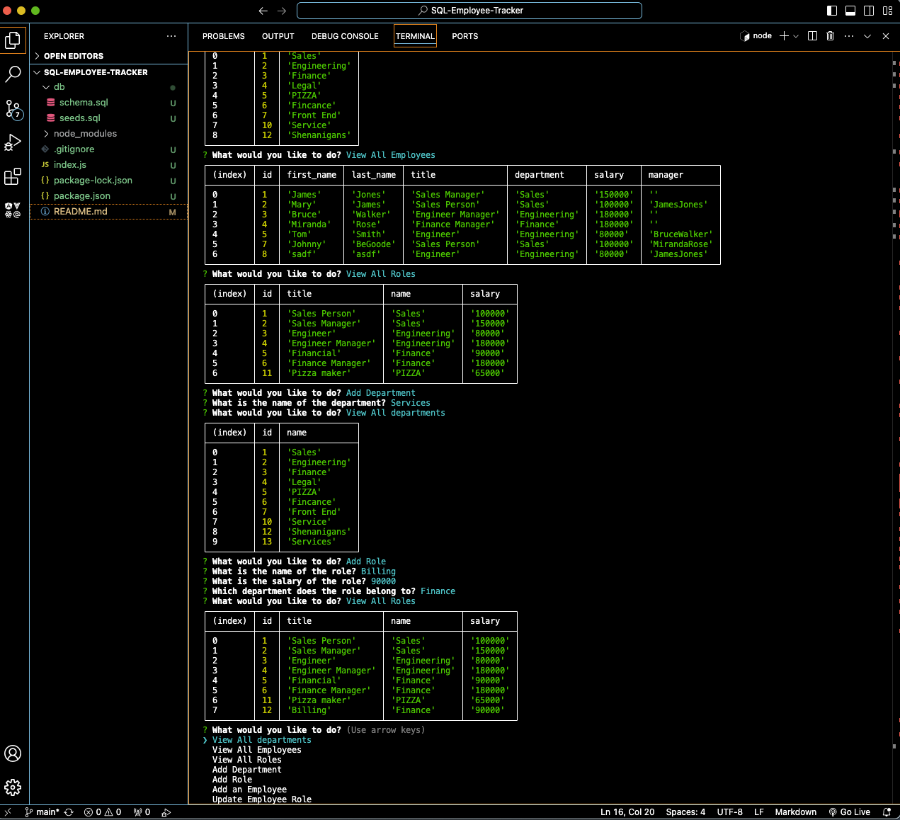

# SQL-Employee-Tracker

Employee tracker is a terminal command line application for entering employee data into a database.

## Instalation

User will need to open their terminal and user will need to install the required packages from npm. The user will need to run the node index.js file.

## Usage

User will be prompted a series of questions. Once the user selects a choice, they will then be prompted to update or view the data.

## Screenshot

## Links

    Github: https://github.com/mirandarb/SQL-Employee-Tracker
    Demo: https://app.screencastify.com/v2/manage/videos/CIYwZqXynFLqQ0Y0X9Wq 